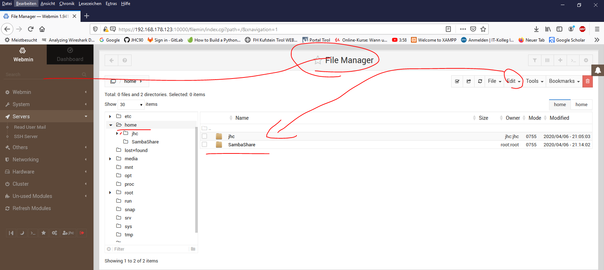

# Samba Simple via Webmin
Mit Samba Simple meine ich eine Version ohne großartige Security Policies
Das Laufwerk wird hier via WebminGui erstellt

## Vorarbeit
1. Install Ubuntu Server Headless // Vorsicht beim [RolloutUbuntuOnHyperV](../RolloutUbunutServerOnHyperV/RolloutUbuntuServerHyperV.md)
> sudo apt-get update && sudo apt-get -y upgrade && sudo apt-get dist-upgrade && sudo reboot
2. Install Openssh
3. install [webmin](./RolloutWebmin.md)

## Samba Installation from Mangament Laptop Web-Gui
Nach folgendem [Youtube-Tutorial](https://www.youtube.com/watch?v=XPh1vOKTjlQ)

1. unused Modules =>sambashare für Windows
   

2. Anlegen eines local Users 
   system => "Users and Groups"
   1. SambaUserLocal || SambaGroupLocal 
   

   2. SambaUser || SambaGroup => brauchts später bei der Anmeldung: 

   

3. file Manager
Anlegen eines Neuen Dir in home für die Shared-Files

ändern der Permissions // zwar für jeden Zugänglich, dennoch habe ich vorher einen User angelegt. Diesen User brauch ich da Windows 10 als Samba Client keinen Zugangn ohne Credentials zulässt.

3. Samba-Connection
   1. Create File Share
   
   erstelle den SambaShare auf dem vorherigen Laufwerk:
   

   2. edit security
   
    
    erlaube writeable & guest zugriff
   

4. Anlegen eines Users: 
   SambaUserLocal || SambaGroupLocal 
   SambaUser || SambaGroup
5. Directory anlegen, das gesharet wird
   1. Vollzugriff gewährleisten
